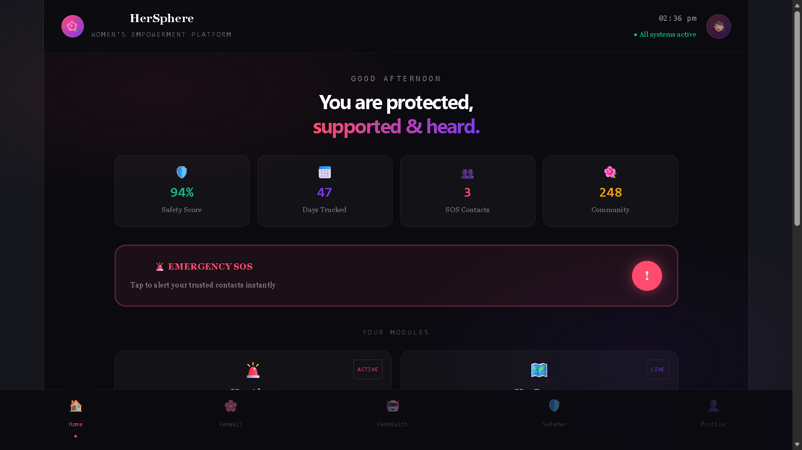
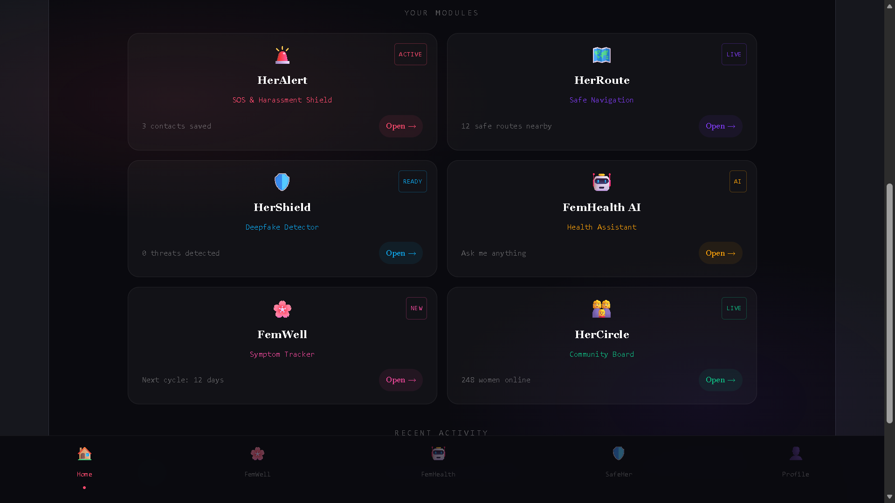
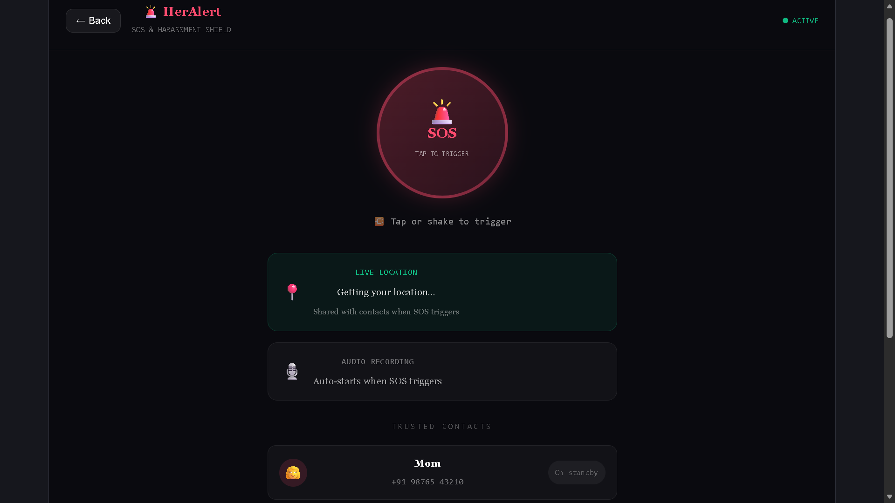
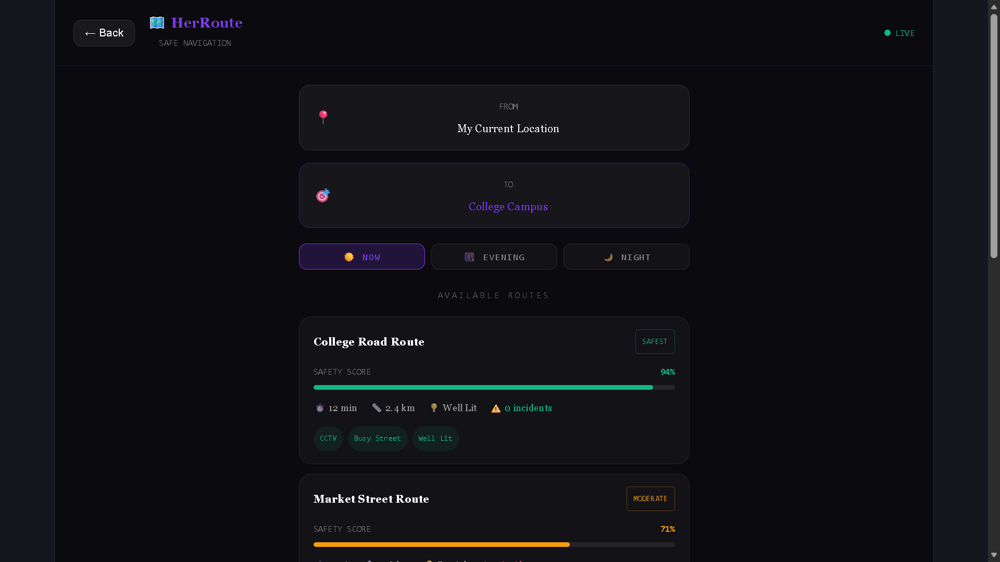
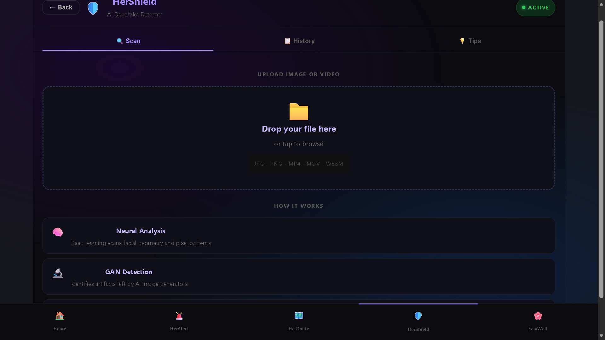
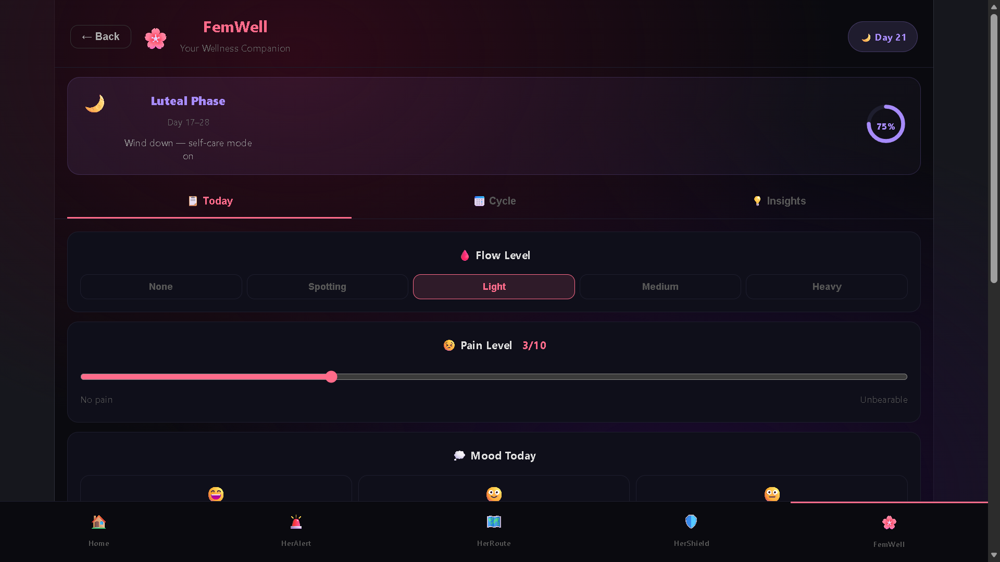
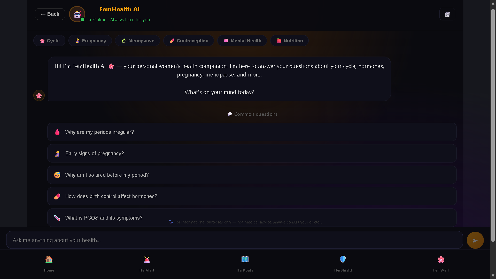
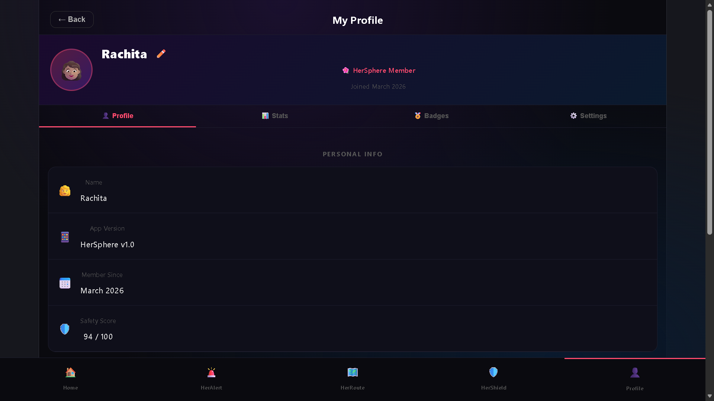

# 🌸 HerSphere
### Women's Empowerment Platform

*"You are protected, supported & heard."*

> 🏆 Built for **SHE INNOVATES** competition by **WISE (Women in Science & Engineering)**

---

## 📖 About

**HerSphere** is a Progressive Web App (PWA) that combines women's **safety** and **health** features into one unified platform. Built as a 2-person team for the SHE INNOVATES competition, the app provides real-time protection tools and wellness tracking — all in a single, installable mobile-first app.

---

## ✨ Features

### 🛡️ Safety Suite

| Feature | Description |
|---|---|
| **🚨 HerAlert** | One-tap SOS button — shares live location + starts audio recording, instantly alerting trusted contacts |
| **🗺️ HerRoute** | Safe navigation with route safety scores (CCTV, lighting, incident history). Rates routes as Safest / Moderate / Unsafe |
| **🛡️ HerShield** | AI-powered deepfake detector using TensorFlow.js — Neural Analysis + GAN Detection on images/videos |

### 💜 Health Suite

| Feature | Description |
|---|---|
| **🌸 FemWell** | Menstrual cycle tracker — logs flow level, pain, mood, symptoms. Shows current cycle phase (Luteal, Follicular, etc.) |
| **🤖 FemHealth AI** | AI chatbot powered by Claude API — answers questions about cycle, hormones, pregnancy, menopause, PCOS, and more |

### 👥 Community
- **HerCircle** — Community board with 248+ women online for peer support

---

## 📱 Screenshots

<table>
  <tr>
    <td align="center"> <b>Home Dashboard</b></td>
    <td align="center"> <b>All Modules</b></td>
  </tr>
  <tr>
    <td align="center"> <b>HerAlert — SOS</b></td>
    <td align="center"> <b>HerRoute — Safe Navigation</b></td>
  </tr>
  <tr>
    <td align="center"> <b>HerShield — Deepfake Detector</b></td>
    <td align="center"> <b>FemWell — Cycle Tracker</b></td>
  </tr>
  <tr>
    <td align="center"> <b>FemHealth AI — Chatbot</b></td>
    <td align="center"> <b>My Profile</b></td>
  </tr>
</table>

---

## 🛠️ Tech Stack

Frontend     →  React + Vite (PWA)
Backend      →  Firebase (Auth, Firestore, Hosting)
AI / ML      →  Claude API (Anthropic) — FemHealth chatbot
               TensorFlow.js — HerShield deepfake detection
Maps         →  Google Maps API — HerRoute navigation

---

## 🚀 Getting Started

### Prerequisites
- Node.js v18+
- npm or yarn
- Firebase project
- Anthropic API key (Claude)
- Google Maps API key

### Installation

Clone the repository:
git clone https://github.com/Rachita-Sharma-06/HerSphere.git

Navigate to project:
cd HerSphere

Install dependencies:
npm install

Start development server:
npm run dev

---

## 👩‍💻 About the Developer

Built with ❤️ by **Rachita Sharma** — 3rd year B.Tech CSE student at GNIOT, Greater Noida.

Passionate about building technology that makes a real difference for women.

---

## 📄 License

This project is for educational and competition purposes.

---

  <i>HerSphere — Because every woman deserves to feel safe, supported, and heard. 🌸</i>

